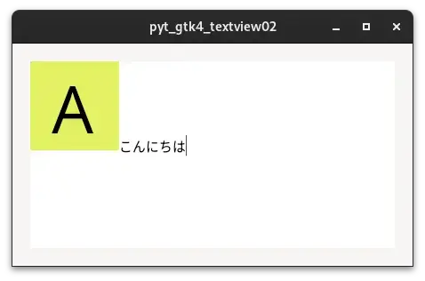

# 02_paintable

[戻る](../README.md)

 

## 内容 

Gtk.TextViewに画像を表示するプログラム
Gtk.TextViewに表示する画像は、Gdk.Pixbufによりファイルから読み込んだものからGdk.Textureを作成して、それをGdk.Paintableとして使用することで実現する。

 

## 参考にしたHP

[戻る](../README.md)
